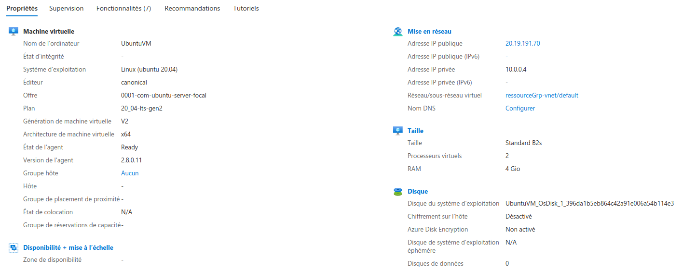
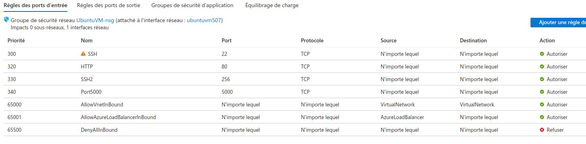

# projet-test-azure-cloud

  chmod 400 UbuntuVM_key.pem  
  ssh -i UbuntuVM_key.pem azureuser@(ip)  
  ssh -p (port) -i UbuntuVM_key.pem azureuser@(ip) dans le dossier de la key.pm  
  git clone (lien git du projet)  
  se mettre sur le dossier du projet et faire : docker-compose up  
  Back : OK : http://20.19.191.70:5000/  
  FRONT : KO  

## Machine Virtuelle 

## Configuration IP

## Networking Ports

